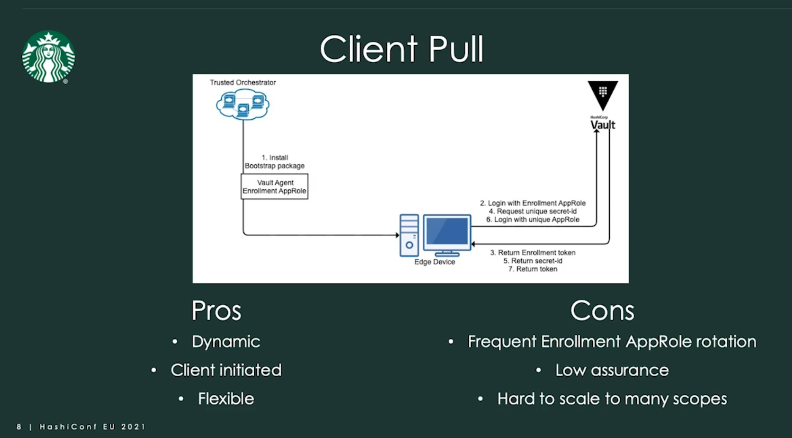
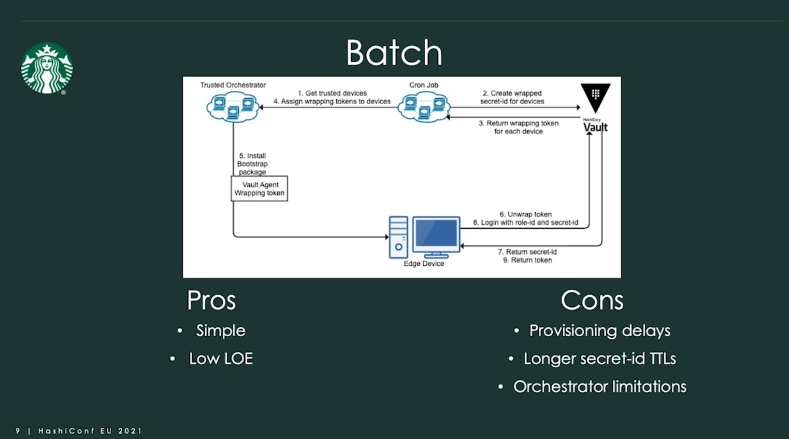

<!-- omit from toc -->
# Vault Security Model

- [Secure Introduction of Vault Clients](#secure-introduction-of-vault-clients)
  - [What is Secret Zero](#what-is-secret-zero)
  - [Secure Introduction Goals](#secure-introduction-goals)
  - [Methods of Providing Authentication to Vault](#methods-of-providing-authentication-to-vault)
  - [Secret Zero Authentication Examples from Starbucks](#secret-zero-authentication-examples-from-starbucks)
    - [Client Pull](#client-pull)
    - [Batch](#batch)
- [Security Implications of Running Vault in Kubernetes](#security-implications-of-running-vault-in-kubernetes)
  - [TLS End to End Encryption](#tls-end-to-end-encryption)
  - [Disable Core Dumps](#disable-core-dumps)
  - [Ensure `mlock` is Enabled](#ensure-mlock-is-enabled)
  - [Container Supervisor](#container-supervisor)
  - [Don't Run Vault as Root](#dont-run-vault-as-root)
  - [Running Vault on Kubernetes Links](#running-vault-on-kubernetes-links)

## Secure Introduction of Vault Clients

### What is Secret Zero

- Secret zero is essentially the "first secret" needed to obtain other secrets
- Example: 1Password or LastPass
- In Vault, this is either the authentication credentials or a Vault token
- Once we have secret zero, we can potentially obtain other credentials. Unfortunately, it also allows for an unauthorized user to elevate privileges in the organization
- The goal is to introduce secret zero in the most secure fashion but only when it's needed for the application to use it

### Secure Introduction Goals

1. Use unique credentials for each application instance provisioned
1. Limit your exposure if a credential is compromised
1. Stop hardcoding credentials within the application codebase
1. Reduce the TTL of the credentials used by applications and reduce long-lived creds
1. Distribute credentials securely and only at runtime
1. Use a trusted platform to verify the identities of clients
1. Employ a trusted orchestrator that is already authenticated to Vault to inject secrets

### Methods of Providing Authentication to Vault

- Secure Platform: [slide 4](https://github.com/sarg3nt/vault-training/blob/main/operations-training/03-Employ-the-Vault-Security-Model.pdf))
- Secure Orchestrator (CI/CD): [slide 5](https://github.com/sarg3nt/vault-training/blob/main/operations-training/03-Employ-the-Vault-Security-Model.pdf))
- Secure Orchestrator (Terraform): [slide 6](https://github.com/sarg3nt/vault-training/blob/main/operations-training/03-Employ-the-Vault-Security-Model.pdf))
- Vault Agent - Auto Auth: [slide 7](https://github.com/sarg3nt/vault-training/blob/main/operations-training/03-Employ-the-Vault-Security-Model.pdf))

[Slides 1-7](https://github.com/sarg3nt/vault-training/blob/main/operations-training/03-Employ-the-Vault-Security-Model.pdf)

### [Secret Zero Authentication Examples from Starbucks](https://www.hashicorp.com/resources/starbucks-secrets-at-the-retail-edge-with-hashicorp-vault)

> **NOTE** There are several more patterns mentioned in the above article but I'm pasting the two I think will be helpful to us here. These would be in addition to the trusted orchestrator pattern (using Kubernetes to inject the secret-id at start up) and along with the CD pattern (having Jenkins inject a `secret-id` file).

#### Client Pull

In the client-based pull pattern, your trusted orchestrator installs a bootstrapping package on every device that gets provisioned. This contains the Vault Agent and a shared enrollment AppRole. This role would be minimally scoped and only have access to request a wrapped secret ID for other devices that are in that scope.

The edge device logs into Vault with the enrollment AppRole and requests a unique secret ID for the desired role ID. Vault would return a unique secret ID to the device, which would then use it to log into Vault and access its secrets.

This is a nice and simple pattern that could work well for use cases with low security requirements or other mitigating controls. It's dynamic and client-initiated, which allows you to use relatively low time-to-live (TTL) for your credentials and enables clients to self-heal if credentials expire.

It's also more flexible than the rest because it doesn't require any unique functions or features from the orchestrator. As long as you can push code to a device, you can use this pattern.

However, this is also the downside to this approach. Having a broad shared role that can be used to assume the identity of any other device within that scope isn't great from a security perspective. You have low assurance on the identity of edge devices, and non-repudiation is nearly impossible.

The enrollment AppRole should also be minimally scoped and rotated frequently, which brings a whole new set of logistical challenges in large-scale environments with many scopes and devices.



#### Batch

The batch approach should look pretty familiar to some of you, as it's a common pattern for integrating between multiple APIs. Here, we have a cronjob that runs on a schedule, let's say every hour. This job queries the orchestrator for a list of all trusted devices that need a Vault credential.

This is the first model that allows us to do some additional posture-checking for trust. It could be as simple as, "I manage this, therefore I trust it," or as complex as, "I manage it, it has all of my security tools, it hasn't been flagged as compromised, and it's never left the geofence."

The cronjob will then loop through the devices from step 1 and request a unique wrap secret ID for each device. Once Vault returns the wrapping tokens, the cronjob will assign those tokens to each device using the orchestrator's API.

The orchestrator then kicks off a bootstrap install package that includes the Vault agent and the wrapping token. The client unwraps the token to get a secret ID and then logs into Vault to request secrets.

This pattern is nice because it's fairly simple and well understood. Your cronjob is effectively just a small API broker, and response wrapping protects the secret as it passes through the tooling. So the level of effort here is fairly low.

This can compromise provisioning at scale, though. If you're trying to provision thousands of devices every day, a 1-hour interval for this cronjob could create a significant bottleneck.

This also tends to result in somewhat longer secret IDs, because you need to leave enough slack in the system to prevent downtime caused by delays or issues with the cronjob. There can also be some orchestrator limitations here, as not all orchestrators have an API that will let you get and set metadata or run packages.



## Security Implications of Running Vault in Kubernetes

### TLS End to End Encryption

- Don't offload TLS at the load balancer
- Ensures end-to-end encryption from the client to the Vault node
- Use TLS certificates signed by a trusted Certificate Authority (CA)
- Require TLS 1.2+

### Disable Core Dumps

- Most commonly, Vault pods are scheduled to run on a separate cluster to reduce/eliminate shared resources
- Core dump files may include Vault's encryption keys
- Ensure `RLIMIT_CORE` is set to 0 or use the `ulimit` command with the core flag  
  `ulimit -c 0`  
  inside the container to ensure your container processes can't core dump.

### Ensure `mlock` is Enabled

- Memory lock ensures memory from a process on a Linux system isn't swapped to disk. Additional configurations are needed for containerized deployments
- The process that starts the container that runs the mlock call must have `IPC_LOCK` capabilities

```yaml
securityContext: 
runAsNonRoot: true 
runAsUser: 1000 
capabilities: 
    add: ["IPC_LOCK"]
```

### Container Supervisor

- If your container starts as root, the processes that might escape that container will also have root on the node
- Mitigations can be used to prevent starting your container as root
  - SecurityContext --> `runAsNonRoot`
  - PodSecurityContext --> `runAsNonRoot`

```yaml
apiVersion: v1
kind: Pod
metadata:
  name: hello-world
spec:
  containers:
  # specification of the pod’s containers
  # ...
  securityContext:
    readOnlyRootFilesystem: true
    runAsNonRoot: true
```

### Don't Run Vault as Root

- Vault is designed to run as an unprivileged user – regardless of the platform
- Elevated privileges can potentially expose the Vault process memory and allow access to Vault encryption keys

### Running Vault on Kubernetes Links

- [Learn How to Run Vault on Kubernetes](https://www.hashicorp.com/blog/learn-how-to-run-vault-on-kubernetes)
- [Run Vault on Kubernetes Documentation](https://developer.hashicorp.com/vault/docs/platform/k8s/helm/run)
- [Vault on Kubernetes Deployment Guide](https://developer.hashicorp.com/vault/tutorials/kubernetes/kubernetes-raft-deployment-guide)
- [Running Vault with Kubernetes](https://www.hashicorp.com/products/vault/kubernetes)
- [Vault Agent with Kubernetes](https://developer.hashicorp.com/vault/tutorials/kubernetes/agent-kubernetes)
- [Slides 8-14](https://github.com/sarg3nt/vault-training/blob/main/operations-training/03-Employ-the-Vault-Security-Model.pdf)
